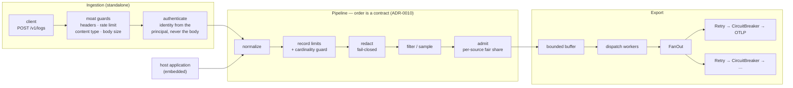

# crier

[](https://github.com/JonasBorgesLM/crier/actions/workflows/ci.yml)
[](https://pkg.go.dev/github.com/JonasBorgesLM/crier/core)
[](https://goreportcard.com/report/github.com/JonasBorgesLM/crier/core)
[](LICENSE)

A Go log-control service and library. It ingests application logs, normalizes
them to the OpenTelemetry Logs data model, **redacts what should never leave the
process**, and exports to observability backends through a pluggable
`Exporter` — embedded in your binary, or as the standalone `crierd` daemon.

> **Status: pre-release.** Nothing is tagged yet. The design is recorded in
> [21 ADRs](docs/adr/README.md) and implemented across
> [milestones M0–M6](https://github.com/JonasBorgesLM/crier/milestones).

## See it work

```bash
docker compose -f demo/compose.yaml up --build
```

Open **http://localhost:3000**. No login, no data source to configure.

```
checkout-service ──▶ crierd ──▶ OpenTelemetry Collector ──▶ Loki ──▶ Grafana
```

Look for the `ERROR` about a failed receipt upload. It was sent with an AWS
access key in its message and a credential under an `api_key` attribute, and it
arrives with both as `[REDACTED]`. There is also a record claiming to come from
`billing-service`, which arrives attributed to `checkout-service`.

Details in [`demo/README.md`](demo/README.md), including how to post a record
yourself and how to watch readiness fail when you stop the collector.

## Why

Most log shippers treat their ingestion endpoint as a trusted internal pipe.
crier does not: it has a [documented threat model](#threat-model),
server-derived source identity, per-source fair-share admission, and
fail-closed redaction — and it states plainly what it does *not* guarantee.

## Delivery semantics — read this first

Stated up front because a reviewer who discovers it later reads it as a bug
(ADR-0009, NFR10):

- **At-least-once.** A record may be exported more than once. Consumers must
  tolerate duplicates.
- **No ordering guarantee across batches.** Within a batch, order is preserved.
- **`202 Accepted` means admitted, not delivered.** It confirms the record
  entered the buffer. Nothing about any backend having stored it.
- **`ObservedTimestamp` is authoritative.** The source-asserted `Timestamp` is
  carried through and exported, but never used for a decision — it may be
  absent, skewed, or falsified.
- **Loss is possible and always counted.** Buffer pressure, per-source quota,
  an unreachable backend, and the shutdown drain each increment their own
  counter, with the reason distinguishable. Silent loss is the one thing that
  is treated as a defect, and a test derives the list of reasons from the
  source so a new one cannot be added without being accounted for.

## Architecture



Only the last pipeline stage touches the buffer, so filtered and rejected
records never consume buffer memory. Steps before `normalize` belong to the
receiver, because they are about the request rather than the record — which is
why the embedded path enters at `normalize` and has no receiver at all.

## Composition

Retry and circuit breaking are **per destination, inside the fan-out**:

```go
exporter, _ := otlp.New(otlp.Config{Endpoint: "https://collector:4318"})
breaker, _ := core.NewCircuitBreaker(core.CircuitBreakerConfig{Name: "primary", Exporter: exporter})
retry, _   := core.NewRetry(core.RetryConfig{Name: "primary", Exporter: breaker})

fanOut, _ := core.NewFanOut(core.FanOutConfig{
    Destinations: []core.Destination{{Name: "primary", Exporter: retry}},
})
```

Building it the other way round — a retry wrapping the fan-out — is a real
defect, not a style preference. If one destination fails, the whole batch is
re-sent, and a healthy destination receives it once per attempt because an
unrelated one is broken. That is audit finding A-1 (ADR-0013).

Both orders are pinned by tests: one asserts the healthy destination receives
the batch exactly once, and one asserts that the wrong order *does* amplify —
so the reason the rule exists stays checkable rather than becoming a comment.

`core.New` (the embedded API) builds this composition for you, which is most of
why it exists.

## Redaction, and its limits

Redaction covers record attributes, resource attributes, **and the message
body** (ADR-0014). It is **fail-closed**: a record that cannot be masked is
dropped and counted, never exported unmasked, and that is not configurable.

**Body redaction is pattern-based and best-effort.** A secret interpolated into
free-form text can only be matched by shape — bearer tokens, JWTs, AWS key IDs,
`key=value` pairs, PEM blocks. A secret with no recognisable shape and no
sensitive-looking key will not be caught, and there is a test that documents
exactly that rather than pretending otherwise.

**Structured attributes are the reliable path**, and also the cheap one:

| | reliability | cost |
| --- | --- | --- |
| Attribute, matched by key | deterministic | 948 ns |
| Message body, matched by shape | best-effort | up to 10 µs |

Put secrets-adjacent values in attributes. That is not a style preference here;
it is the difference between a control that works and one that usually works.

## Threat model

The ingestion endpoint is an attack surface. Threats explicitly considered, and
where each is addressed:

| Threat | Mitigation |
| --- | --- |
| Log forgery by an unauthenticated caller | Per-source authentication, constant-time credential comparison (ADR-0008) |
| Source spoofing via client-asserted `service.name` | Identity derived server-side from the authenticated principal; client fields overwritten and the discrepancy counted (ADR-0008) |
| Credential-store enumeration | An unknown source and a wrong secret return the same error and take the same code path, including a comparison against a decoy |
| Volume/cost abuse | Per-source fair-share admission, so a noisy source degrades itself rather than its neighbours (ADR-0011, ADR-0019) |
| Resource exhaustion — oversized bodies, unbounded attributes, high cardinality | Transport and record limits plus a bounded cardinality guard, applied to the embedded path too (ADR-0010) |
| Sensitive data leaked to a third-party backend | Fail-closed redaction covering attributes *and* body (ADR-0014) |
| Forged identity headers behind a proxy | Trusted-proxy mode is opt-in; a config trusting every peer refuses to start (ADR-0008, and the same fix `moat` made in `realip`) |
| A silent feedback loop | An exporter pointed at this instance's own receiver refuses to start (NFR11) |

## Install

```bash
go install github.com/JonasBorgesLM/crier/cmd/crierd@latest   # the daemon
go get github.com/JonasBorgesLM/crier/core                    # the library
```

## Usage

### Embedded library

The same engine, with no receiver: the host application calls it directly and
owns the trust boundary itself.

```go
crier, err := core.New(core.Options{
    ServiceName: "task-api",
    Exporters:   map[string]core.Exporter{"primary": otlpExporter},
    Limits:      core.Limits{MaxAttributes: 64},
})
if err != nil {
    return err
}

_ = crier.Log(ctx, core.LogRecord{Severity: core.SeverityError, Body: "database unreachable"})

summary, err := crier.Shutdown(ctx) // loss at shutdown is reported, never silent
```

`Log` returns once the record is buffered, not once it is exported, so your
request latency does not depend on whether a backend is healthy. Input limits
apply here exactly as they do to the HTTP receiver: a bug in the host produces
the same unbounded attribute map as a malicious client.

### Standalone daemon

```bash
crierd -config /etc/crier/config.json
```

Configuration is a JSON file plus `CRIER_*` environment overrides, validated at
startup — a bad redaction rule, a fair-share configuration that over-commits
the buffer, or a trusted-proxy set covering the default route all refuse to
start. Credentials are read from the environment by preference, because a file
is committed by accident far more often than an environment is.

| Endpoint | Meaning |
| --- | --- |
| `POST /v1/logs` | Ingestion. `202` means admitted to the buffer, not exported |
| `GET /healthz` | Liveness. Stays true while degraded and while draining |
| `GET /readyz` | Readiness. `503` while draining, and while every destination's circuit is open |

Probes are served on a separate address, loopback by default — the readiness
reason names which destinations are refusing calls, which is operational detail
for whoever runs crier, not for whoever sends it logs.

**A failing `/readyz` during a backend outage is not a crash loop.** The
instance is alive, still holding what it buffered, and still probing behind the
breakers; it is saying it cannot accept more.

On `SIGTERM` the daemon stops accepting, drains within the configured timeout,
and logs a final line saying how many records were lost and to which
destinations. Loss at shutdown is permitted; silent loss is not.

## Wire format

`POST /v1/logs`, `application/json`. **Unknown fields are rejected and the
error names the offending one** (ADR-0012): a service that misspells
`severityText` and receives `202` looks healthy while emitting records with no
severity.

```bash
curl -i localhost:4318/v1/logs \
  -H 'Content-Type: application/json' \
  -H 'Authorization: Bearer checkout-service:<credential>' \
  -d '{"records":[{"severityNumber":9,"body":"hello"}]}'
```

Adding optional fields is backwards-compatible; renaming, removing, or
retyping one — in the request *or* the response — requires a new path version
(ADR-0021).

## Benchmarks

Measured with every stage enabled — limits, cardinality guard, redaction,
filtering, admission — because that is how the pipeline runs. Apple M1.

| Path | ns/op | allocs/op |
| --- | --- | --- |
| Full pipeline, message with no credential (the common case) | 2,086 | 7 |
| Full pipeline, message containing a credential (worst case) | 12,128 | 10 |
| Full pipeline, 8 cores contended | 3,813 | 10 |
| Body scan, nothing to mask | 38 | 0 |
| Cardinality guard | 705 | 8 |
| Per-source admission | 106 | 1 |

Body redaction is **8% of the common-case path and 84% of the worst case**.
Everything else together is under 1 µs. That asymmetry is the concrete reason
structured attributes are preferred over interpolated message text.

Full results — including the attribution by difference, two performance defects
this benchmark found, and the one deliberately left open — are in
[`docs/benchmarks.md`](docs/benchmarks.md).

## Verification

Every push runs, per module: `go build`, `go vet`, `gofmt`, `go mod tidy`
verification, `go test -race -shuffle=on`, `golangci-lint`, and `govulncheck`.
Two guards run alongside them: `core` must have no third-party dependencies,
and no library module may depend on gRPC (ADR-0018). The OTLP exporter is also
tested against a real OpenTelemetry Collector in a container.

Test coverage at the time of writing: `core` 96.2%, `receivers/http` 94.3%,
`exporters/otlp` 90.5%, `cmd/crierd` 81.0%. Reproduce with `go test -cover ./...`
in each module.

## Documentation

- [Requirements](REQUIREMENTS.md) — functional, non-functional, ecosystem
- [Architecture Decision Records](docs/adr/README.md) — 21 decisions, with amendments
- [Benchmarks](docs/benchmarks.md) — hot-path measurements and what they found
- [Ecosystem integrations](docs/integrations/README.md) — `task-api`, `gateway-auth`, `moat`
- [Audit log](docs/audit-log.md) — review passes, findings, and who performed them
- [Releasing](RELEASING.md) — the tag order, and why it is not optional
- [Security probes](docs/security/probe-threats.sh) — the threat model, exercised against a running receiver
- [Demo](demo/README.md) — the one-command end-to-end stack
- [Contributing](CONTRIBUTING.md)

## License

MIT — see [LICENSE](LICENSE).
